# LISTEN MUSIC ONLINE (lmo_g9) - Create by Group 9
### We make a application use for listen music online all free on internet !!
### - Language / Technology:
- Front-end: Aspx, Css/Less, Js/Jquery, Bootstrap 4, Fontawsome 5
- Back-end: C#, ASP.NET, Ajax, SQL Server
### - Documentation:
- [Fontawsome Gallery](https://fontawesome.com/icons)
- [Get Boostrap 4](https://getbootstrap.com/docs/4.5/getting-started/introduction/)
- [Bootstrap 4 Tutorial](https://www.w3schools.com/bootstrap4/default.asp)
### - Setup commandline:
- [How to setup terminal like mac/Linux on Windows | WSL | Windows Terminal | oh-my-zsh | powerlevel10k](https://www.youtube.com/watch?v=yJpj33Jtpd0&t=90s)
- [Less CSS Pre-Processor Tutorial](https://www.youtube.com/watch?v=YD91G8DdUsw&t=321s)
### - About us: 
- [HungVV - Vu Van Hung](https://www.facebook.com/hungvv2808/)
- [YenPV - Pham Van Yen](https://www.facebook.com/Soul.Of.Death.Sofd)
- [TienPH - Pham Hoang Tien](https://www.facebook.com/niet1017)
- [HieuNK - Nguyen Khac Hieu](https://www.facebook.com/hieu.khac.777)
### - Build less/css:
- Front-end:

		$ lessc ../LMO_G9/LMO_G9/view/template/css/less/client/style.less ../LMO_G9/LMO_G9/view/template/css/style.css
- Back-end:
	
		$ lessc ../LMO_G9/LMO_G9/view/template/css/less/admin/custom.less ../LMO_G9/LMO_G9/view/template/css/custom.css

### - Diagram SQL:

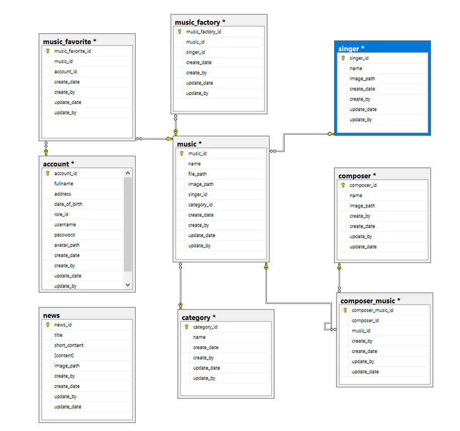

### - Demo product:
- Carousel slide show:

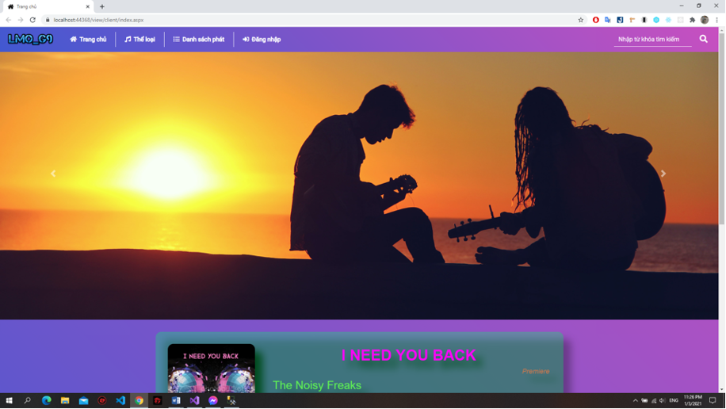

- Audio play music:

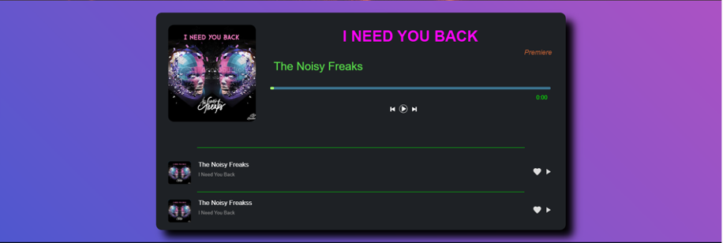

- Footer:

- Type music:

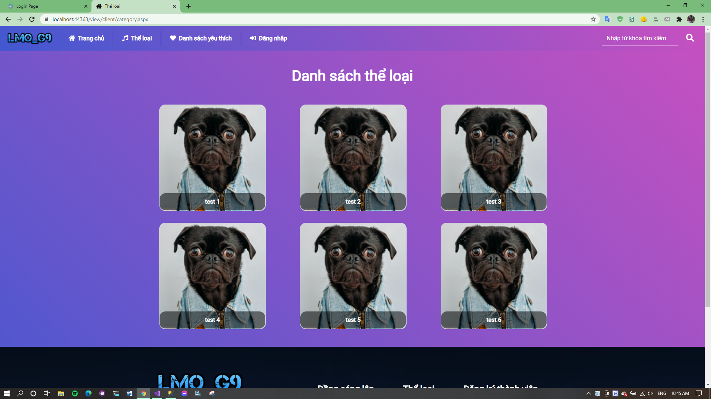

- Login client:

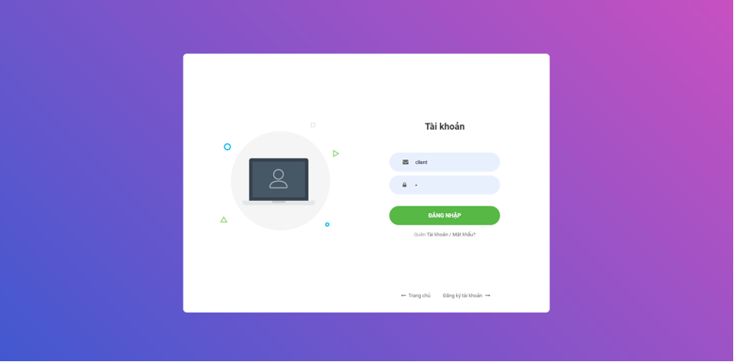

- Register client:

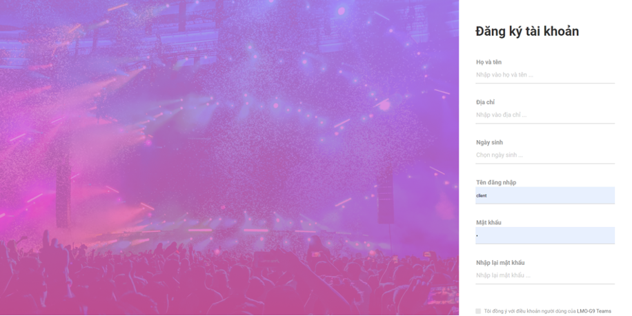

- Profile user:

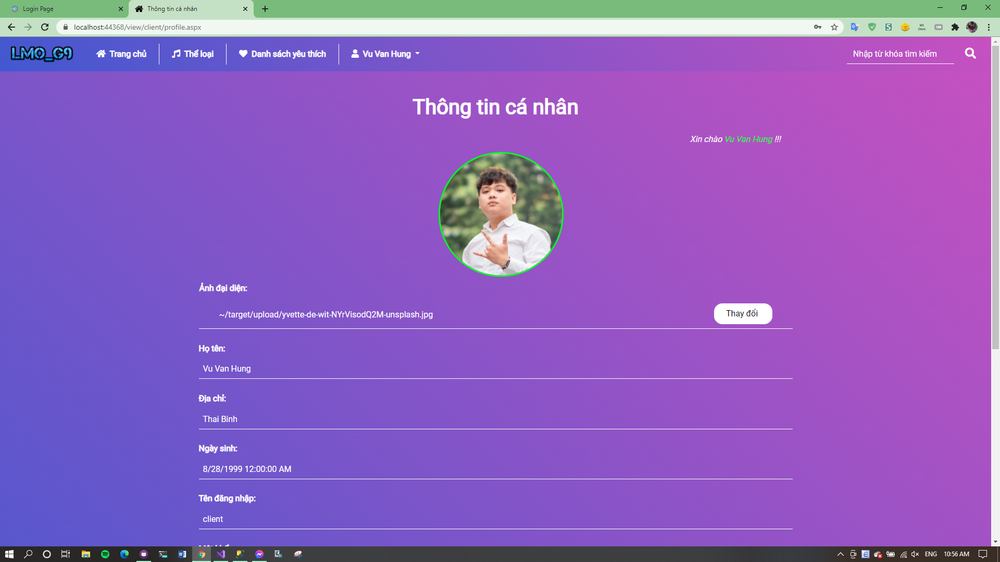

- Login admin:

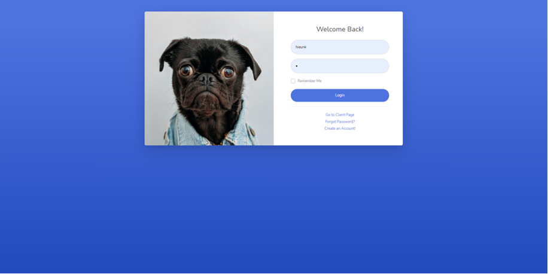

- Register admin:

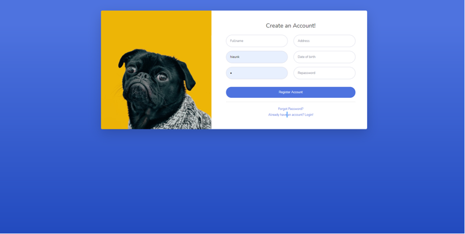

- Forgot-password:

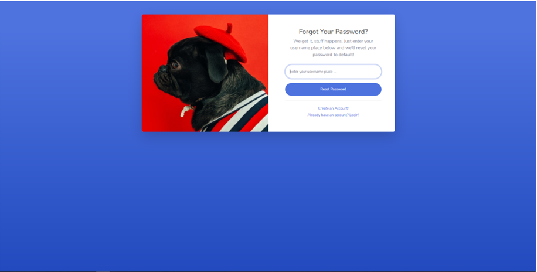

- Dashboard admin:

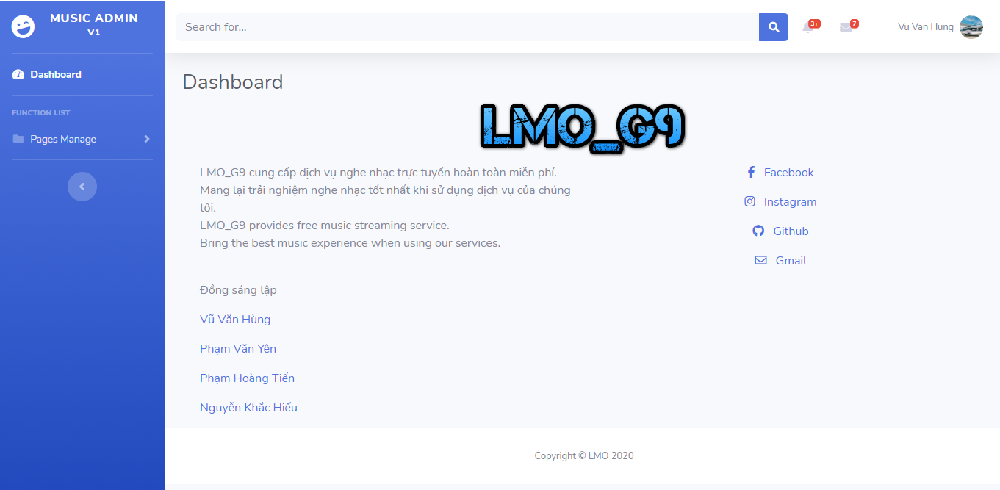

- Category admin:

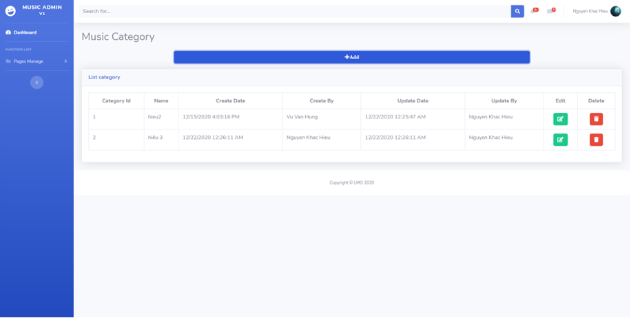